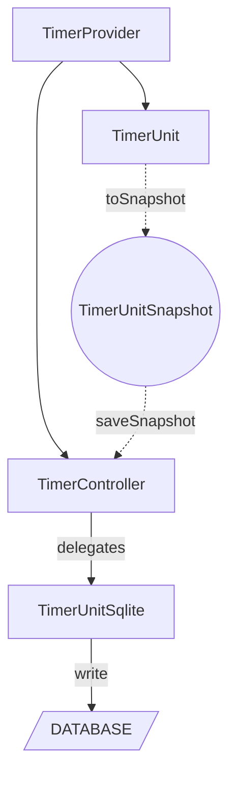
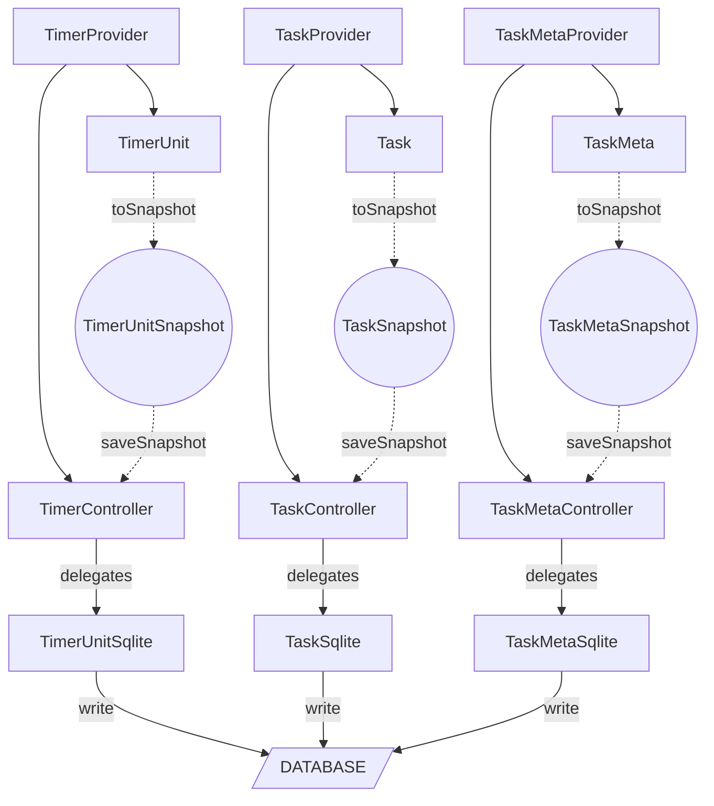
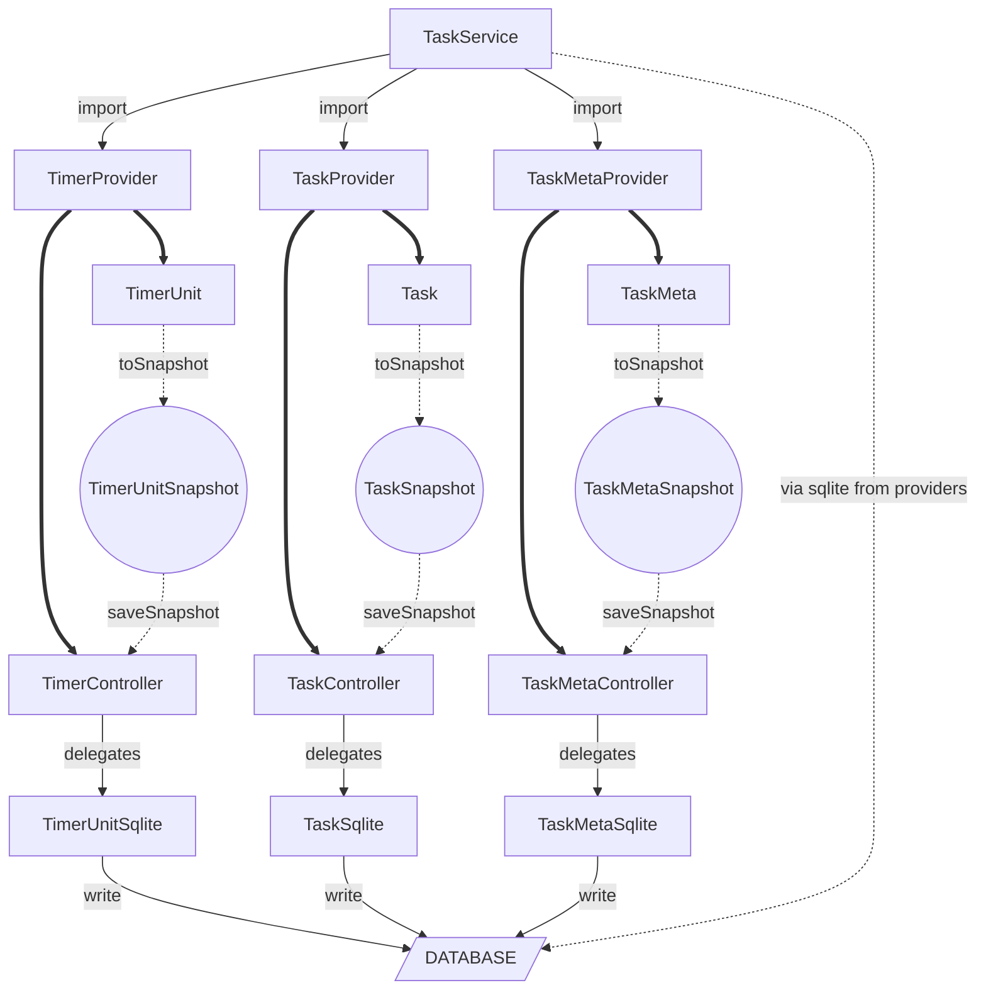

# How to Save A Moment? 

不仅仅是History，还有前面的Task

### How to Put TimerUnit into Task ?

目前TimerUnit保存的逻辑：



大部分逻辑都相互孤立，需要各自保存：



我们希望的逻辑：



不仅仅是存储逻辑，依托于Service我们也可以打包其他操作。

### Provider or Providers ?

这样的实现并不难，只需要TaskService引入几个provider，进行对应操作就好。关键在于provider和controller的不同。

```dart
// timerProvider暴露的状态是TimerUnit
final timerProvider = AsyncNotifierProvider<TimerController, TimerUnit>(
  () => TimerController(),
);

// 而taskMappingProvider暴露的状态是List<TaskMapping>
final taskMappingProvider = AsyncNotifierProvider<TaskMappingController, List<TaskMapping>>(
  () => TaskMappingController(),
);
```

taskMappingProvider并不是我写的，而是通义灵码写的。上下就形成了两套方案：

对于这种要同时管理多个实体的情况，可以采用它写的

```dart
// 以history为例
final historyProvider = AsyncNotifierProvider<HistoryController, List<History>>(
  () => HistoryController(),
);
```

或者这样分开

```dart
HistoryProvider = AsyncNotifierProvider<HistoryController, History>(
  () => HistoryController(),
);

final historyProviderList = List<HistoryProvider>;
```

后者可能在控制粒度上更加精细，层次分明，但是性能上肯定不如第一种。

然而，若仅从性能角度判断优劣，实际上是片面的。关键在于状态管理的**目标结构**与**访问频率**。我们可以继续从 Riverpod 的运行机制与状态更新策略来深入思考这两种方案的技术权衡。

在采用 `AsyncNotifierProvider<Controller, List<T>>` 的模式时，Riverpod 将整个 `List<T>` 作为一个整体状态对象进行观察。这意味着：

1. **优点是简洁统一**：每次增删改操作，只需要调用 controller 的对应方法，然后统一刷新整个列表。代码结构清晰，使用者只需监听一次即可感知所有变动。
2. **缺点是性能瓶颈明显**：只要列表中任何一个元素发生变化，比如修改了一个 `History` 条目的某个字段，整个 `List<History>` 会被重构并通知重建所有依赖组件，哪怕只有一项变化。Flutter 的 `==` 检查是浅比较，如果整个列表对象变了，就触发 rebuild。

相比之下，若采用“每个实体一个 provider” 的方式，即：

```dart
final singleHistoryProvider = AsyncNotifierProviderFamily<HistoryController, History, String>(
  (ref, uuid) => HistoryController(uuid),
);
```

再将它们通过某种集合结构管理（如 `Map<String, Provider<History>>`），则有以下特性：

1. **优点是高粒度响应**：只有具体 `uuid` 对应的 `History` 状态变更时，才会触发对应依赖的刷新。这对于高频率增量操作（如某些历史记录需要逐条变更）是更优的。
2. **缺点是管理复杂性上升**：我们需要自行管理这些 provider 的创建与回收，否则可能导致内存泄露或资源浪费。此外，批量操作（如查询所有 history 并加载）不再简单，需要遍历构建 provider 并聚合其状态。

这也引出了第三种中庸思路：**分组状态管理**。即将一个 provider 的状态拆分为多个子状态结构体，并在 controller 内精细地管理变更逻辑：

```dart
class HistoryController extends AsyncNotifier<List<History>> {
  Future<void> updateHistory(String uuid, History updated) async {
    state = await AsyncValue.guard(() async {
      final list = [...state.value!];
      final index = list.indexWhere((h) => h.uuid == uuid);
      if (index != -1) list[index] = updated;
      return list;
    });
  }
}
```

这种方法依然使用 `List<History>`，但 controller 负责对比并最小化变更粒度。配合 Riverpod 的 `select` 方法，还可以实现在 UI 中只监听某个 `History` 项：

```dart
final specificHistoryProvider = Provider.family<History?, String>((ref, uuid) {
  final list = ref.watch(historyProvider).value;
  return list?.firstWhere((h) => h.uuid == uuid, orElse: () => null);
});
```

由此可见，这三种方式本质上是**粒度 vs 管理成本 vs 性能**三者间的平衡：

- 若关注的是用户对“整体信息的快速加载”，优先用 `List<T>`。
- 若关注的是“个别项的频繁更新”，倾向于 `ProviderFamily`。
- 若希望两者折中，需精细管理 controller 的变更逻辑，并辅助 `select` 与 `family`。

特别地，在涉及 **SQLite 存储同步** 的场景下，如何与 provider 状态保持一致，也是架构的关键问题。使用 `List<T>` 模式下，往往意味着一次完整同步，而使用 `ProviderFamily` 则支持懒加载、局部持久化，这对数据量大的历史记录场景尤为关键。

因此，Timer 使用单个实体 `TimerUnit` 状态是合理的，因为用户通常只关心当前的活动计时器。但 History、TaskMapping 等天然是集合的概念，选用 `List<T>` 还是 `ProviderFamily<T, ID>`，需要结合实际更新频率、使用场景与 UI 粒度来决定，不能一概而论。

最终，这样的设计选择还应与调试工具（如 Riverpod devtool）、性能监测、热重载友好度、模块化测试能力等因素协同考量。在成熟项目中，这些隐性的长期成本往往比初期的编码效率更值得关注。