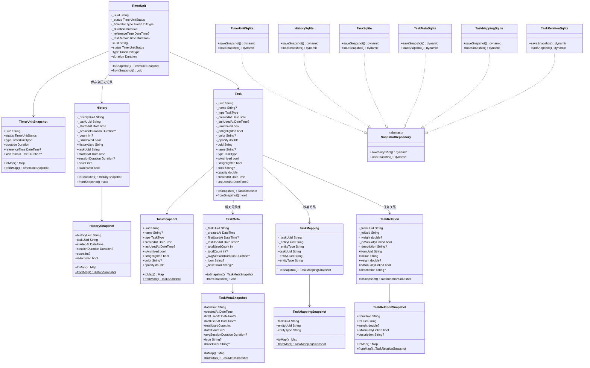

# How to Save History

不仅仅是History，还有前面的Task

## 从TimerUnit到History

我们先数数我们手里有什么。

```mermaid
classDiagram
    class TimerUnit {
        -_uuid String
        -_status TimerUnitStatus
        -_timerUnitType TimerUnitType
        -_duration Duration
        -_referenceTime DateTime?
        -_lastRemainTime Duration?
        +uuid String
        +status TimerUnitStatus
        +type TimerUnitType
        +duration Duration
        +toSnapshot() TimerUnitSnapshot
        +fromSnapshot() void
    }
    
    class TimerUnitSnapshot {
        +uuid String
        +status TimerUnitStatus
        +type TimerUnitType
        +duration Duration
        +referenceTime DateTime?
        +lastRemainTime Duration?
        +toMap() Map<String, dynamic>
        +fromMap()$ TimerUnitSnapshot
    }
    
    class History {
        -_historyUuid String
        -_taskUuid String
        -_startedAt DateTime
        -_sessionDuration Duration?
        -_count int?
        -_isArchived bool
        +historyUuid String
        +taskUuid String
        +startedAt DateTime
        +sessionDuration Duration?
        +count int?
        +isArchived bool
        +toSnapshot() HistorySnapshot
        +fromSnapshot() void
    }
    
    class HistorySnapshot {
        +historyUuid String
        +taskUuid String
        +startedAt DateTime
        +sessionDuration Duration?
        +count int?
        +isArchived bool
        +toMap() Map<String, dynamic>
        +fromMap()$ HistorySnapshot
    }
    
    class Task {
        -_uuid String
        -_name String?
        -_type TaskType
        -_createdAt DateTime
        -_lastUsedAt DateTime?
        -_isArchived bool
        -_isHighlighted bool
        -_color String?
        -_opacity double
        +uuid String
        +name String?
        +type TaskType
        +isArchived bool
        +isHighlighted bool
        +color String?
        +opacity double
        +createdAt DateTime
        +lastUsedAt DateTime?
        +toSnapshot() TaskSnapshot
        +fromSnapshot() void
    }
    
    class TaskSnapshot {
        +uuid String
        +name String?
        +type TaskType
        +createdAt DateTime
        +lastUsedAt DateTime?
        +isArchived bool
        +isHighlighted bool
        +color String?
        +opacity double
        +toMap() Map<String, dynamic>
        +fromMap()$ TaskSnapshot
    }
    
    class TaskMeta {
        -_taskUuid String
        -_createdAt DateTime
        -_firstUsedAt DateTime?
        -_lastUsedAt DateTime?
        -_totalUsedCount int
        -_totalCount int?
        -_avgSessionDuration Duration?
        -_icon String?
        -_baseColor String?
        +toSnapshot() TaskMetaSnapshot
        +fromSnapshot() void
    }
    
    class TaskMetaSnapshot {
        +taskUuid String
        +createdAt DateTime
        +firstUsedAt DateTime?
        +lastUsedAt DateTime?
        +totalUsedCount int
        +totalCount int?
        +avgSessionDuration Duration?
        +icon String?
        +baseColor String?
        +toMap() Map<String, dynamic>
        +fromMap()$ TaskMetaSnapshot
    }
    
    class TaskMapping {
        -_taskUuid String
        -_entityUuid String
        -_entityType String
        +taskUuid String
        +entityUuid String
        +entityType String
        +toSnapshot() TaskMappingSnapshot
    }
    
    class TaskMappingSnapshot {
        +taskUuid String
        +entityUuid String
        +entityType String
        +toMap() Map<String, dynamic>
        +fromMap()$ TaskMappingSnapshot
    }
    
    class TaskRelation {
        -_fromUuid String
        -_toUuid String
        -_weight double?
        -_isManuallyLinked bool
        -_description String?
        +fromUuid String
        +toUuid String
        +weight double?
        +isManuallyLinked bool
        +description String?
        +toSnapshot() TaskRelationSnapshot
    }
    
    class TaskRelationSnapshot {
        +fromUuid String
        +toUuid String
        +weight double?
        +isManuallyLinked bool
        +description String?
        +toMap() Map<String, dynamic>
        +fromMap()$ TaskRelationSnapshot
    }
    
    class TimerUnitSqlite {
        +saveSnapshot() dynamic
        +loadSnapshot() dynamic
    }
    
    class HistorySqlite {
        +saveSnapshot() dynamic
        +loadSnapshot() dynamic
    }
    
    class TaskSqlite {
        +saveSnapshot() dynamic
        +loadSnapshot() dynamic
    }
    
    class TaskMetaSqlite {
        +saveSnapshot() dynamic
        +loadSnapshot() dynamic
    }
    
    class TaskMappingSqlite {
        +saveSnapshot() dynamic
        +loadSnapshot() dynamic
    }
    
    class TaskRelationSqlite {
        +saveSnapshot() dynamic
        +loadSnapshot() dynamic
    }
    
    class SnapshotRepository {
        <<abstract>>
        +saveSnapshot()* dynamic
        +loadSnapshot()* dynamic
    }
    
    TimerUnit --> TimerUnitSnapshot
    TimerUnit --> Task
    Task --> TaskSnapshot
    TaskMeta --> TaskMetaSnapshot
    TaskMapping --> TaskMappingSnapshot
    TaskRelation --> TaskRelationSnapshot
    History --> HistorySnapshot
    
    TimerUnitSqlite ..|> SnapshotRepository
    HistorySqlite ..|> SnapshotRepository
    TaskSqlite ..|> SnapshotRepository
    TaskMetaSqlite ..|> SnapshotRepository
    TaskMappingSqlite ..|> SnapshotRepository
    TaskRelationSqlite ..|> SnapshotRepository
    
    TimerUnit --> History : 保存到历史记录
    Task --> TaskMeta : 相关元数据
    Task --> TaskMapping : 映射关系
    Task --> TaskRelation : 任务关系
```

