# 架构
## 类图
Generated by dcdg
==关于枚举部分看个乐呵即可，dcdg不怎么会处理==

```mermaid
classDiagram

class SnapshotBase
<<abstract>> SnapshotBase
SnapshotBase : +toMap()* Map<String, dynamic>

class TimerUnitSnapshot
TimerUnitSnapshot : +uuid String
TimerUnitSnapshot : +status TimerUnitStatus
TimerUnitSnapshot o-- TimerUnitStatus
TimerUnitSnapshot : +type TimerUnitType
TimerUnitSnapshot o-- TimerUnitType
TimerUnitSnapshot : +duration Duration
TimerUnitSnapshot : +referenceTime DateTime?
TimerUnitSnapshot : +lastRemainTime Duration?
TimerUnitSnapshot : +toMap() Map<String, dynamic>
TimerUnitSnapshot : +fromMap()$ TimerUnitSnapshot
SnapshotBase <|-- TimerUnitSnapshot

class UserSettingsSnapshot
UserSettingsSnapshot : +language String?
UserSettingsSnapshot : +enableDarkMode bool?
UserSettingsSnapshot : +autoDarkMode bool?
UserSettingsSnapshot : +darkModeFollowSystem bool?
UserSettingsSnapshot : +themeColor String?
UserSettingsSnapshot : +enableSound bool?
UserSettingsSnapshot : +enableFinishedSound bool?
UserSettingsSnapshot : +enableNotification bool?
UserSettingsSnapshot : +enableDebug bool?
UserSettingsSnapshot : +enableLog bool?
UserSettingsSnapshot : +defaultTaskType TaskType?
UserSettingsSnapshot o-- TaskType
UserSettingsSnapshot : +defaultTimerUnitType TimerUnitType?
UserSettingsSnapshot o-- TimerUnitType
UserSettingsSnapshot : +countdownDuration Duration?
UserSettingsSnapshot : +toMap() Map<String, dynamic>
UserSettingsSnapshot : +mergeWith() UserSettingsSnapshot
UserSettingsSnapshot : +fromMap()$ UserSettingsSnapshot
UserSettingsSnapshot : -_boolFromInt()$ bool?
SnapshotBase <|-- UserSettingsSnapshot

class TaskMetaSnapshot
TaskMetaSnapshot : +uuid String
TaskMetaSnapshot : +name String
TaskMetaSnapshot : +type String
TaskMetaSnapshot : +createAt DateTime
TaskMetaSnapshot : +description String?
TaskMetaSnapshot : +archived bool
TaskMetaSnapshot : +toMap() Map<String, dynamic>
TaskMetaSnapshot : +fromMap()$ TaskMetaSnapshot
SnapshotBase <|-- TaskMetaSnapshot

class TaskType
<<enumeration>> TaskType
TaskType : +index int
TaskType : +values$ List~TaskType~
TaskType : +timer$ TaskType
TaskType o-- TaskType
TaskType : +note$ TaskType
TaskType o-- TaskType
Enum <|.. TaskType

class TimerType
<<enumeration>> TimerType
TimerType : +index int
TimerType : +values$ List~TimerType~
TimerType : +forward$ TimerType
TimerType o-- TimerType
TimerType : +countdown$ TimerType
TimerType o-- TimerType
Enum <|.. TimerType

class DefaultSettings
DefaultSettings : +language$ String
DefaultSettings : +enableDarkMode$ bool
DefaultSettings : +autoDarkMode$ bool
DefaultSettings : +darkModeFollowSystem$ bool
DefaultSettings : +themeColor$ String
DefaultSettings : +enableSound$ bool
DefaultSettings : +enableFinishedSound$ bool
DefaultSettings : +enableNotification$ bool
DefaultSettings : +enableDebug$ bool
DefaultSettings : +enableLog$ bool
DefaultSettings : +defaultTaskType$ TaskType
DefaultSettings o-- TaskType
DefaultSettings : +defaultTimerUnitType$ TimerUnitType
DefaultSettings o-- TimerUnitType
DefaultSettings : +countdownDuration$ Duration
DefaultSettings : +toSnapshot()$ UserSettingsSnapshot

class TimerUnitStatus
<<enumeration>> TimerUnitStatus
TimerUnitStatus : +index int
TimerUnitStatus : +values$ List~TimerUnitStatus~
TimerUnitStatus : +active$ TimerUnitStatus
TimerUnitStatus o-- TimerUnitStatus
TimerUnitStatus : +inactive$ TimerUnitStatus
TimerUnitStatus o-- TimerUnitStatus
TimerUnitStatus : +paused$ TimerUnitStatus
TimerUnitStatus o-- TimerUnitStatus
TimerUnitStatus : +timeout$ TimerUnitStatus
TimerUnitStatus o-- TimerUnitStatus
Enum <|.. TimerUnitStatus

class TimerStatus
<<enumeration>> TimerStatus
TimerStatus : +index int
TimerStatus : +values$ List~TimerStatus~
TimerStatus : +inactive$ TimerStatus
TimerStatus o-- TimerStatus
TimerStatus : +active$ TimerStatus
TimerStatus o-- TimerStatus
TimerStatus : +paused$ TimerStatus
TimerStatus o-- TimerStatus
Enum <|.. TimerStatus

class TimerUnitType
<<enumeration>> TimerUnitType
TimerUnitType : +index int
TimerUnitType : +values$ List~TimerUnitType~
TimerUnitType : +countup$ TimerUnitType
TimerUnitType o-- TimerUnitType
TimerUnitType : +countdown$ TimerUnitType
TimerUnitType o-- TimerUnitType
Enum <|.. TimerUnitType

class Clock
Clock : -_instance$ Clock
Clock o-- Clock
Clock : -_timeDrift int
Clock : -_timezoneOffset int
Clock : +currentTime DateTime
Clock : +setTimeDrift() void
Clock : +setTimezoneOffset() void
Clock : +reset() void

class UuidHelper
UuidHelper : +getUuid()$ String

class TimerController
TimerController : -_repo TimerUnitSqlite
TimerController o-- TimerUnitSqlite
TimerController : -_settings UserSettings
TimerController o-- UserSettings
TimerController : +build() dynamic
TimerController : +create() dynamic
TimerController : +loadFromUuid() dynamic
TimerController : +save() dynamic
TimerController : +start() dynamic
TimerController : +stop() dynamic
TimerController : +pause() dynamic
TimerController : +resume() dynamic
AsyncNotifier <|-- TimerController

class ConfigController
ConfigController : -_repo UserSettingsSqlite
ConfigController o-- UserSettingsSqlite
ConfigController : +build() dynamic
ConfigController : +load() dynamic
ConfigController : +save() dynamic
AsyncNotifier <|-- ConfigController

class AppStartupService
AppStartupService : -_database AppDatabase
AppStartupService o-- AppDatabase
AppStartupService : -_taskRepo TaskMetaSqlite
AppStartupService o-- TaskMetaSqlite
AppStartupService : -_timerRepo TimerUnitSqlite
AppStartupService o-- TimerUnitSqlite
AppStartupService : -_settingsRepo UserSettingsSqlite
AppStartupService o-- UserSettingsSqlite
AppStartupService : +timerRepo dynamic
AppStartupService : +settingsRepo dynamic
AppStartupService : +initializeApp() dynamic
AppStartupService : -_recoverUnfinishedTimers() dynamic

class UserSettings
UserSettings : -_language String?
UserSettings : -_enableDarkMode bool?
UserSettings : -_autoDarkMode bool?
UserSettings : -_darkModeFollowSystem bool?
UserSettings : -_themeColor String?
UserSettings : -_enableSound bool?
UserSettings : -_enableFinishedSound bool?
UserSettings : -_enableNotification bool?
UserSettings : -_enableDebug bool?
UserSettings : -_enableLog bool?
UserSettings : -_defaultTaskType TaskType?
UserSettings o-- TaskType
UserSettings : -_defaultTimerUnitType TimerUnitType?
UserSettings o-- TimerUnitType
UserSettings : -_countdownDuration Duration?
UserSettings : +language String?
UserSettings : +enableDarkMode bool?
UserSettings : +autoDarkMode bool?
UserSettings : +darkModeFollowSystem bool?
UserSettings : +themeColor String?
UserSettings : +enableSound bool?
UserSettings : +enableFinishedSound bool?
UserSettings : +enableNotification bool?
UserSettings : +enableDebug bool?
UserSettings : +enableLog bool?
UserSettings : +defaultTaskType TaskType?
UserSettings o-- TaskType
UserSettings : +defaultTimerUnitType TimerUnitType?
UserSettings o-- TimerUnitType
UserSettings : +countdownDuration Duration?
UserSettings : +toSnapshot() UserSettingsSnapshot
UserSettings : +fromSnapshot() void

class TimerUnitSqlite
TimerUnitSqlite : +db Database
TimerUnitSqlite o-- Database
TimerUnitSqlite : -_table$ String
TimerUnitSqlite : +saveSnapshot() dynamic
TimerUnitSqlite : +loadSnapshot() dynamic
SnapshotRepository <|.. TimerUnitSqlite

class AppDatabase
AppDatabase : +defaultDbName$ String
AppDatabase : -_db Database
AppDatabase o-- Database
AppDatabase : -_initialized bool
AppDatabase : +db Database
AppDatabase o-- Database
AppDatabase : +init() dynamic
AppDatabase : +setupSchema() dynamic
AppDatabase : +checkInitialized() dynamic
AppDatabase : +setInitializedFlag() dynamic

class TaskMetaSqlite
TaskMetaSqlite : +db Database
TaskMetaSqlite o-- Database
TaskMetaSqlite : -_table$ String
TaskMetaSqlite : +saveSnapshot() dynamic
TaskMetaSqlite : +loadSnapshot() dynamic
SnapshotRepository <|.. TaskMetaSqlite

class UserSettingsSqlite
UserSettingsSqlite : +db Database
UserSettingsSqlite o-- Database
UserSettingsSqlite : -_table$ String
UserSettingsSqlite : +saveSnapshot() dynamic
UserSettingsSqlite : +loadSnapshot() dynamic
SnapshotRepository <|.. UserSettingsSqlite

class SnapshotRepository
<<abstract>> SnapshotRepository
SnapshotRepository : +saveSnapshot()* dynamic
SnapshotRepository : +loadSnapshot()* dynamic

class TimerBase
<<abstract>> TimerBase
TimerBase : +isCountup bool
TimerBase : +isCountdown bool
TimerBase : +duration()* Duration
TimerBase : +referenceTime()* DateTime
TimerBase : +start()* void
TimerBase : +stop()* void

class CountupTimer
CountupTimer : -_totalDuration Duration
CountupTimer : -_startTime DateTime?
CountupTimer : +isCountup bool
CountupTimer : +isCountdown bool
CountupTimer : +totalDuration Duration
CountupTimer : +startTime DateTime
CountupTimer : +duration() Duration
CountupTimer : +referenceTime() DateTime
CountupTimer : +start() void
CountupTimer : +stop() void
CountupTimer : +reset() void
TimerBase <|-- CountupTimer

class CountdownTimer
CountdownTimer : -_remainDuration Duration
CountdownTimer : -_endTime DateTime?
CountdownTimer : +isCountup bool
CountdownTimer : +isCountdown bool
CountdownTimer : +remainDuration Duration
CountdownTimer : +endTime DateTime
CountdownTimer : +duration() Duration
CountdownTimer : +referenceTime() DateTime
CountdownTimer : +start() void
CountdownTimer : +stop() void
CountdownTimer : +reset() void
TimerBase <|-- CountdownTimer

class TimerUnit
TimerUnit : -_uuid String
TimerUnit : -_status TimerUnitStatus
TimerUnit o-- TimerUnitStatus
TimerUnit : -_timerUnitType TimerUnitType
TimerUnit o-- TimerUnitType
TimerUnit : -_currentTimer TimerBase
TimerUnit o-- TimerBase
TimerUnit : -_duration Duration
TimerUnit : -_referenceTime DateTime?
TimerUnit : -_lastRemainTime Duration?
TimerUnit : +clock Clock
TimerUnit o-- Clock
TimerUnit : +uuid String
TimerUnit : +status TimerUnitStatus
TimerUnit o-- TimerUnitStatus
TimerUnit : +type TimerUnitType
TimerUnit o-- TimerUnitType
TimerUnit : +duration Duration
TimerUnit : +toCountup() void
TimerUnit : +toCountdown() void
TimerUnit : +start() void
TimerUnit : +pause() void
TimerUnit : +resume() void
TimerUnit : +stop() void
TimerUnit : -_update() void
TimerUnit : -_checkTimeout() void
TimerUnit : -_reset() void
TimerUnit : +toSnapshot() TimerUnitSnapshot
TimerUnit : +fromSnapshot() void

class TaskMeta
TaskMeta : -_uuid String
TaskMeta : -_name String
TaskMeta : -_type String
TaskMeta : -_createAt DateTime
TaskMeta : -_description String?
TaskMeta : -_archived bool
TaskMeta : +name String
TaskMeta : +type String
TaskMeta : +description String?
TaskMeta : +archived bool
TaskMeta : +toSnapshot() TaskMetaSnapshot
TaskMeta : +fromSnapshot() void
```

## 前端
- 使用Timer.periodic()手动刷新，定期与后台同步.

## 数据库
- [x] meta与实体解耦，如task_meta,task_notes,task_tags

## 数据结构与类
- ~~自定义 EntityWithMeta类，而不是使用Tuple2等.~~

# 开发构思与日志
## 2025年
### 5月
**11日A**
- ~~TimerUnit作为实体，Task作为标签或状态被持有.~~ `抽象所有类为Task`
- ~~对于TimerUnit使用SQLite单表，建立索引优化查找速度.~~ `拆成多表`
- 准备编写Task部分，然后进行数据库读写测试.
- ==状态管理准备使用Riverpod+StateNotifier.==

**11日B**
数据库设计相关：
- [x] TimerUnit表包含所有可执行的TimerUnit的全部状态，可以从此读取恢复计时.
- ~~添加任务名称到TimerUnit中，但是唯一标识仍是uuid.~~ `保持解耦`
- [x] 对于计时历史单独记录一张表，使用uuid区别任务. 只需记录uuid、持续时长、计时开始时间.
- ~~有必要维护一张uuid与名称关联的表，方便转移历史.~~ `创建meta表`

**12日A**
- ~~基于EntityWithMeta派生具体类.~~ `原本采用的是SnapshotWithMeta,但是这层封装没有意义. `

**13&14日AB**
- 休息一下，马上回来（其实14日是有水一下的）

**15日A**
- 暂时解决了数据库问题（未经测试）
- 编写了部分初始化模块，尚未完成逻辑
- 数据库结构已经搭建了，但是相应的逻辑没有完成（snapshot没有处理好）

**16日A**
- [x] 将snapshot纳入SnapshotBase基类
- [x] 理清了存储关系
- [x] ==考虑将哲学观点融入项目设计==
- [x] ~~PotatoTask名字并不是很好，考虑改名“Existimer”，不过这个阶段最重要的不是名字~~ `已改名`
- [x] 删除了SnapshotWithMeta,该类没有起到作用

**17日B**
- [x] 完成了设置的编写
- [x] 数不清的工作
- [x] 数据库基本没问题
- 发现TimerUnit工作竟然尚未完成，暂且搁置

**18日A**
- 还在调试数据库和计时模块. 上次重构后没有进行测试. 必须重写一部分Timer，解决初始化时endTime等没有生成的问题，以及倒计时的逻辑问题. 

**19日至21日**
- [x] 数据库和TimerUnit模块等调试完毕，修复了发现的所有问题，准备水两天休息一下
- 下阶段准备完善一下settings/config的部分，然后准备riverpod架构的设计

**TILL 25日**
- keep alive. 预计25日继续项目，最近专注于考研复习和各种课程的期末项目.

### 6月
**TILL 3日**
- 进入期末周复习，暂停更新

**24日**
- code review

**25日**
- 重新开工
- 缕清了Riverpod的基本概念
- 重构了timer_controller.dart、timer_provider.dart等相关代码，该部分代码尚未完成

**26日**
- 考虑重新组织UML图

**27日**
- 编写调试完成timer_provider.dart
- 测试了timer_provider.dart

**28日**
- 编写了config_controller.dart
- 编写了config_provider.dart
- 生成了类图

**29日**
- 架构&review Task、Meta

### 7月
**4日至19日**
- 小修小改，以期末、考研复习为主
- 主要修改了数据库方面，添加了数据库版本功能和升级功能
- 确定下来Task和TaskMeta的问题，对此重新设计了数据库

**19日**
- 考虑将计时方法统一换成Unix时间戳(毫秒级)，而不是ISO-8601