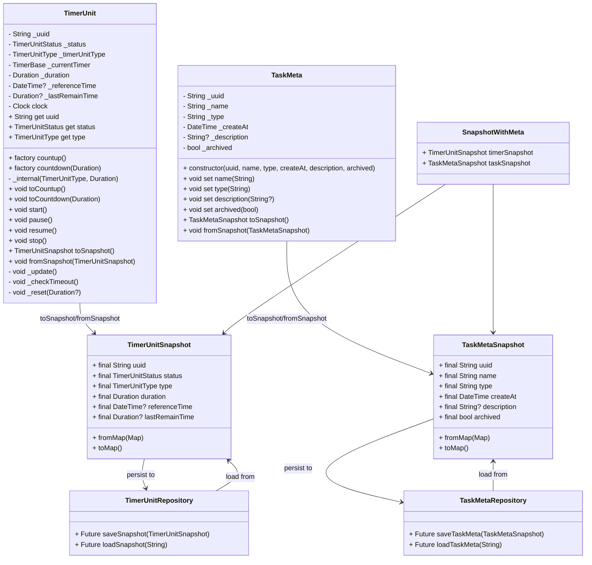

# 架构
## 前端
- 使用Timer.periodic()手动刷新，定期与后台同步.

## 数据库
- meta与实体解耦，如task_meta,task_notes,task_tags

## 数据结构与类
- 自定义 EntityWithMeta类，而不是使用Tuple2等.

# 开发构思与日志
## 2025年
### 5月
**11日A**
- ~~TimerUnit作为实体，Task作为标签或状态被持有.~~ `抽象所有类为Task`
- ~~对于TimerUnit使用SQLite单表，建立索引优化查找速度.~~ `拆成多表`
- 准备编写Task部分，然后进行数据库读写测试.
- 状态管理准备使用Riverpod+StateNotifier.

**11日B**
数据库设计相关：
- TimerUnit表包含所有可执行的TimerUnit的全部状态，可以从此读取恢复计时.
- ~~添加任务名称到TimerUnit中，但是唯一标识仍是uuid.~~ `保持解耦`
- 对于计时历史单独记录一张表，使用uuid区别任务. 只需记录uuid、持续时长、计时开始时间.
- ~~有必要维护一张uuid与名称关联的表，方便转移历史.~~ `创建meta表`

**12日A**
- 基于EntityWithMeta派生具体类.

**13&14日**
- 休息一下，马上回来（其实14日是有水一下的）

**15日A**
- 暂时解决了数据库问题（未经测试）
- 编写了部分初始化模块，尚未完成逻辑
- 数据库结构已经搭建了，但是相应的逻辑没有完成（snapshot没有处理好）

**16日A**

