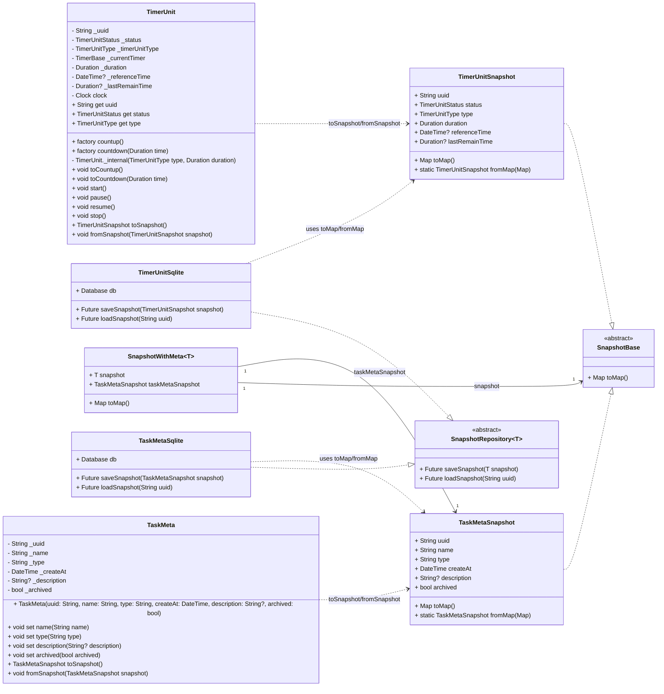

# 架构
## UML图
暂时未完成

## 前端
- 使用Timer.periodic()手动刷新，定期与后台同步.

## 数据库
- [x] meta与实体解耦，如task_meta,task_notes,task_tags

## 数据结构与类
- ~~自定义 EntityWithMeta类，而不是使用Tuple2等.~~

# 开发构思与日志
## 2025年
### 5月
**11日A**
- ~~TimerUnit作为实体，Task作为标签或状态被持有.~~ `抽象所有类为Task`
- ~~对于TimerUnit使用SQLite单表，建立索引优化查找速度.~~ `拆成多表`
- 准备编写Task部分，然后进行数据库读写测试.
- ==状态管理准备使用Riverpod+StateNotifier.==

**11日B**
数据库设计相关：
- [x] TimerUnit表包含所有可执行的TimerUnit的全部状态，可以从此读取恢复计时.
- ~~添加任务名称到TimerUnit中，但是唯一标识仍是uuid.~~ `保持解耦`
- [x] 对于计时历史单独记录一张表，使用uuid区别任务. 只需记录uuid、持续时长、计时开始时间.
- ~~有必要维护一张uuid与名称关联的表，方便转移历史.~~ `创建meta表`

**12日A**
- ~~基于EntityWithMeta派生具体类.~~ `原本采用的是SnapshotWithMeta,但是这层封装没有意义. `

**13&14日AB**
- 休息一下，马上回来（其实14日是有水一下的）

**15日A**
- 暂时解决了数据库问题（未经测试）
- 编写了部分初始化模块，尚未完成逻辑
- 数据库结构已经搭建了，但是相应的逻辑没有完成（snapshot没有处理好）

**16日A**
- [x] 将snapshot纳入SnapshotBase基类
- [x] 理清了存储关系
- [x] ==考虑将哲学观点融入项目设计==
- [x] PotatoTask名字并不是很好，考虑改名“Existimer”，不过这个阶段最重要的不是名字
- [x] 删除了SnapshotWithMeta,该类没有起到作用

**17日B**
- [x] 完成了设置的编写
- [x] 数不清的工作
- [x] 数据库基本没问题
- 发现TimerUnit工作竟然尚未完成，暂且搁置